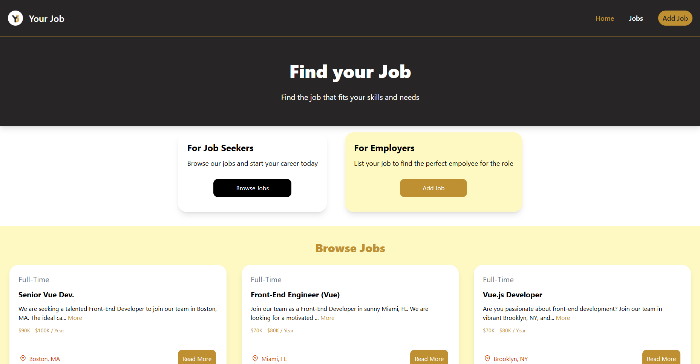
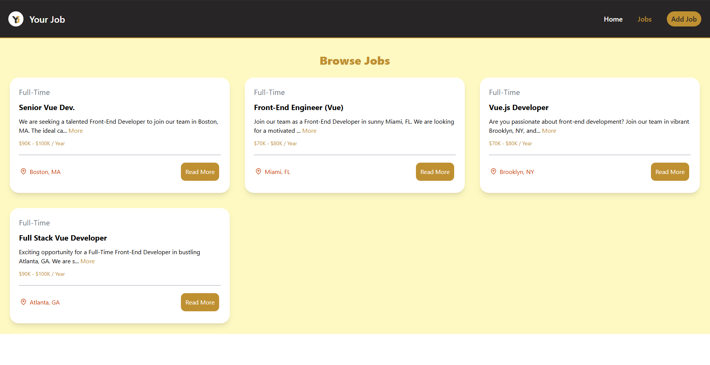
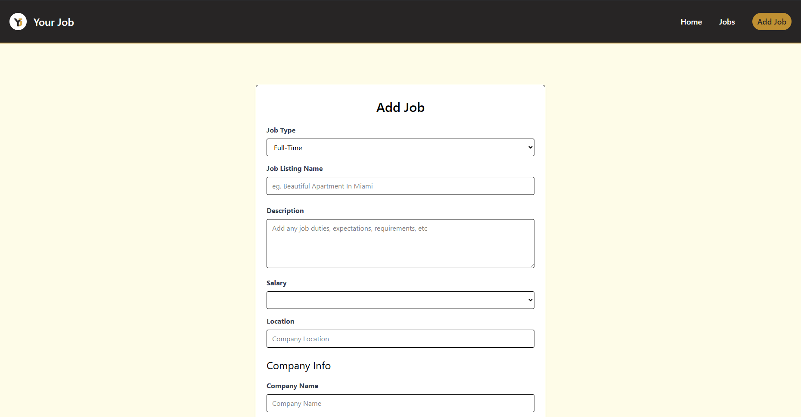

# 🧩 YourJob — Simple Vue.js Job Listings App

YourJob is a lightweight **Vue.js 3** application that allows users to **view** and **add** job listings.  
It uses a local `jobs.json` file as its database, making it perfect for small projects, demos, or learning Vue fundamentals.

---

## 🚀 Features

- 📝 Add new job listings  
- 👀 View all jobs with details (title, type, location, description)  
- 💾 Local data storage using `jobs.json`  
- ⚡ Built with **Vue.js 3 + Composition API**  
- 💡 Clean and responsive UI  

---

## 📸 Screenshots

### 🏠 Home Page


### 💼 Jobs Page


### ➕ Add Job Page


---

## 🛠️ Tech Stack

- **Vue.js 3**
- **Vite** (for fast builds and hot reload)
- **Tailwind CSS** (for styling)
- **Local JSON data** (`jobs.json`)

---

## ⚙️ Setup Instructions

### 1️⃣ Clone the Repository
```bash
git clone https://github.com/Ahmed-Al-Hemyari/yourjob
cd your-job
```

### 2️⃣ Install Dependencies
```bash
npm install
```

### 3️⃣ Run the App
```bash
npm run dev
```

### 4️⃣ Open in Browser
Navigate to the link shown in your terminal (usually [http://localhost:5173](http://localhost:5173))

---

## 📂 Project Structure

```
yourjob/
├── public/
│   └── jobs.json           # Local job listings data
├── src/
│   ├── assets/              # Logo Image
│   ├── components/          # Reusable Vue components
│   ├── views/               # Home, Jobs, and Add Job pages
│   ├── router/              # index.js
│   ├── App.vue
│   └── main.js
│   └── jobs.json           # Local job listings data
├── screenshots/
│   ├── home-page.png
│   ├── jobs-page.png
│   └── add-job-page.png
└── package.json
```

---

## 📘 How It Works

- The app loads data from `jobs.json` and displays it in the Jobs page.  
- New jobs added through the form appear immediately in the UI.  
- *(Optional)* You can connect a real backend or API later for persistent data.

---

## 👨‍💻 Developer

**Ahmed Al-Hemyari**  
🔗 [GitHub Profile](https://github.com/Ahmed-Al-Hemyari)  
💼 [LinkedIn Profile](https://www.linkedin.com/in/ahmed-alhemyari/)
